## Effective Documentation of Project 1

`sudo apt update package list update`

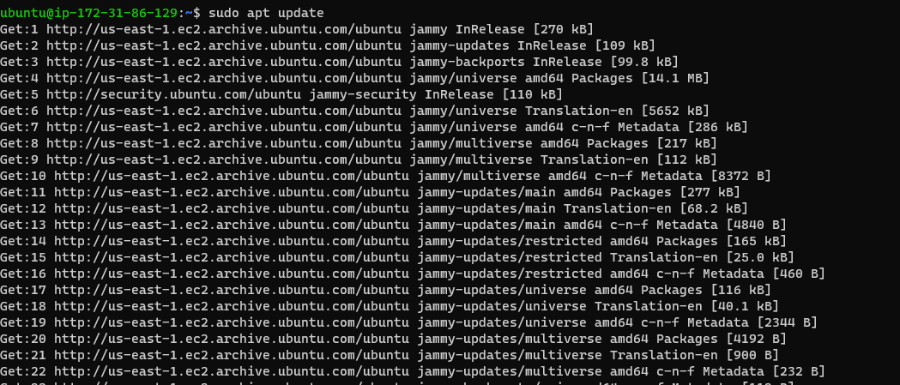

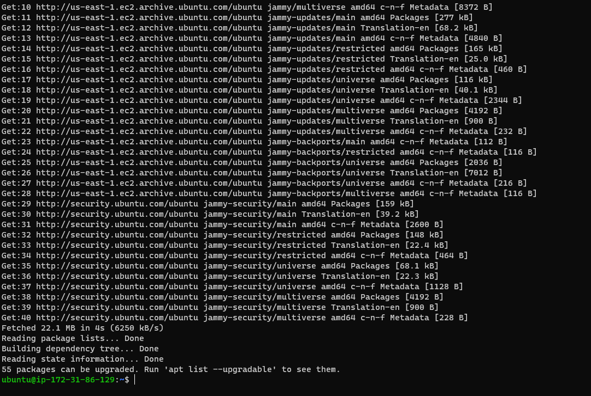

`sudo apt install apache2 package installation`

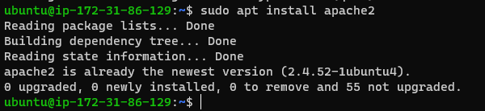

`sudo systemctl status apache2 verify service running on OS`

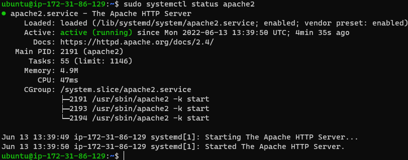

- [install-open-ssh](https://docs.microsoft.com/en-us/windows-server/administration/openssh/openssh_install_firstuse)

- [markdown-repository](https://www.markdownguide.org/cheat-sheet/#overview)

`curl access locally`

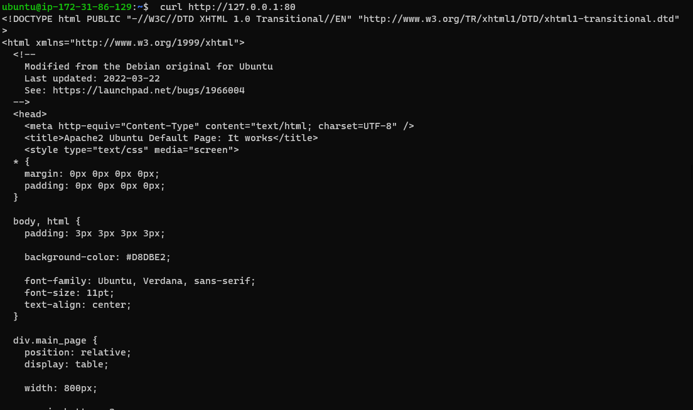

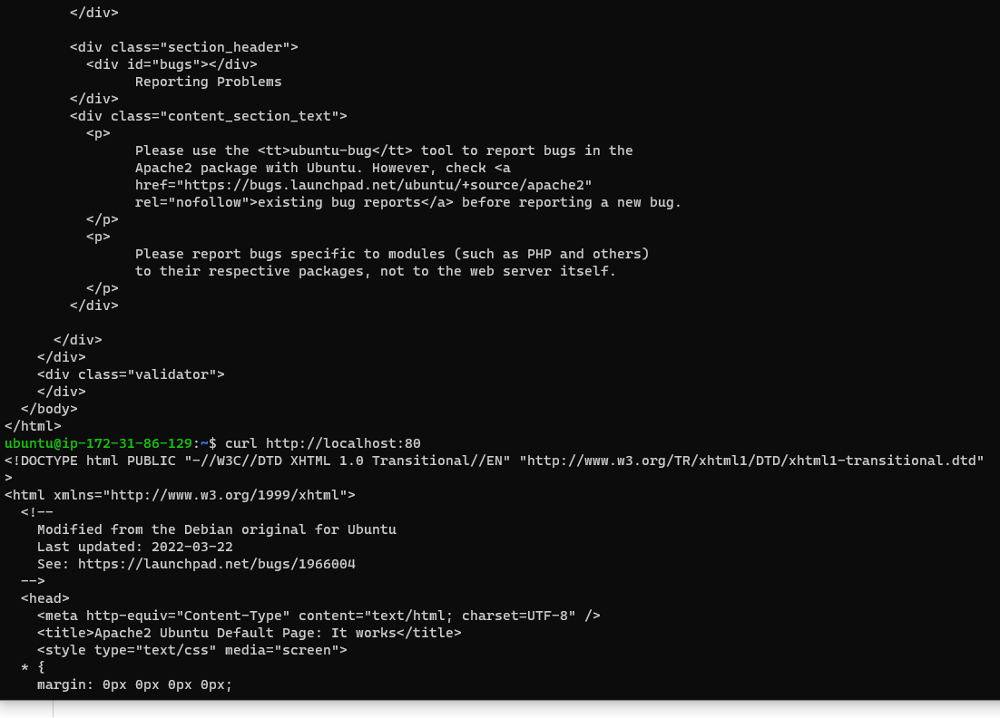

`Apache HTTP Server response on Internet`

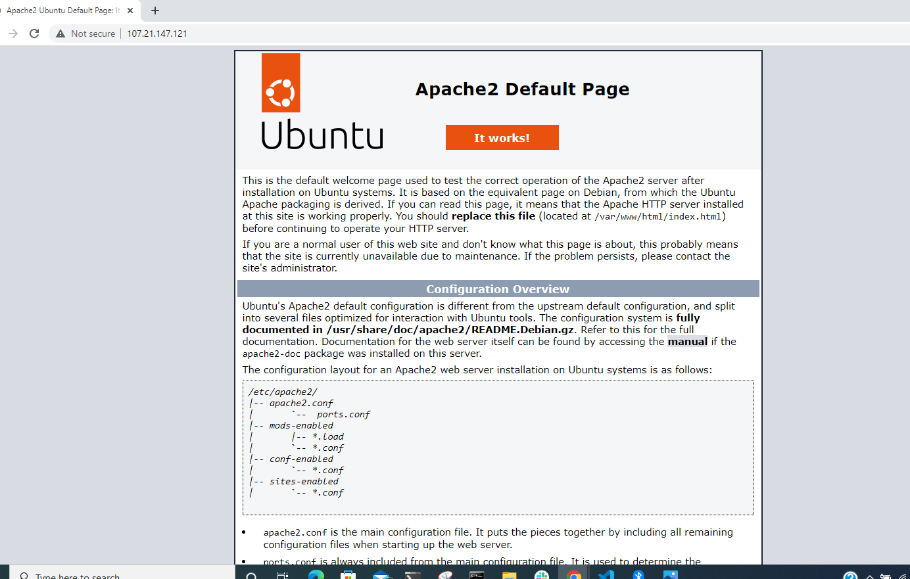

`Retrieve public IP Address`

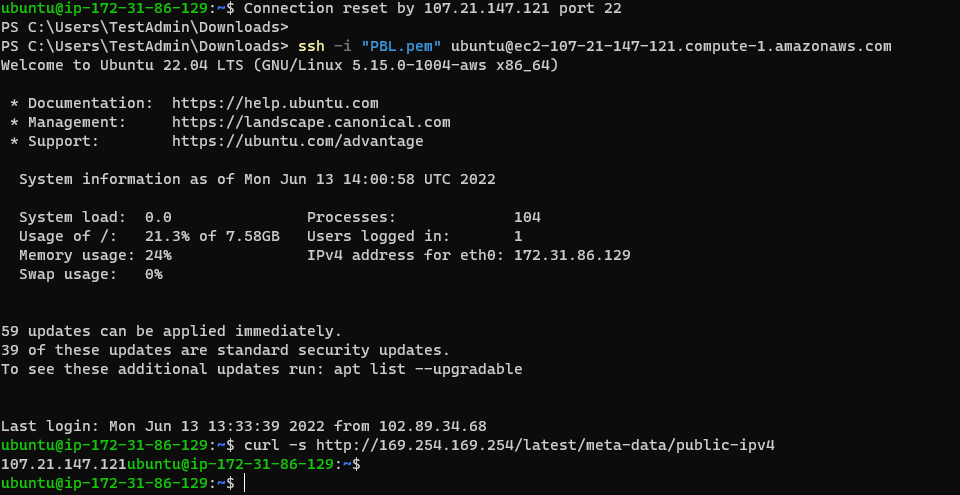

`Installing MYSQL Server`

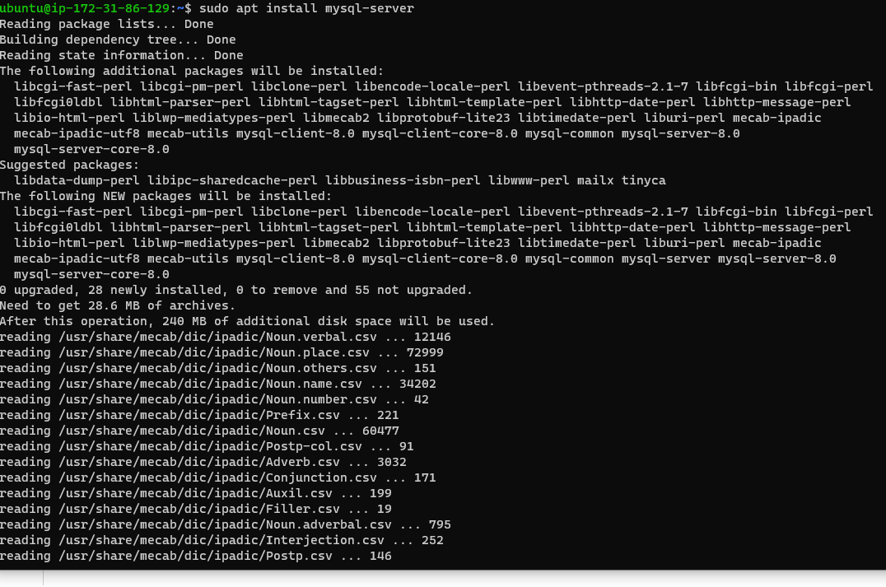

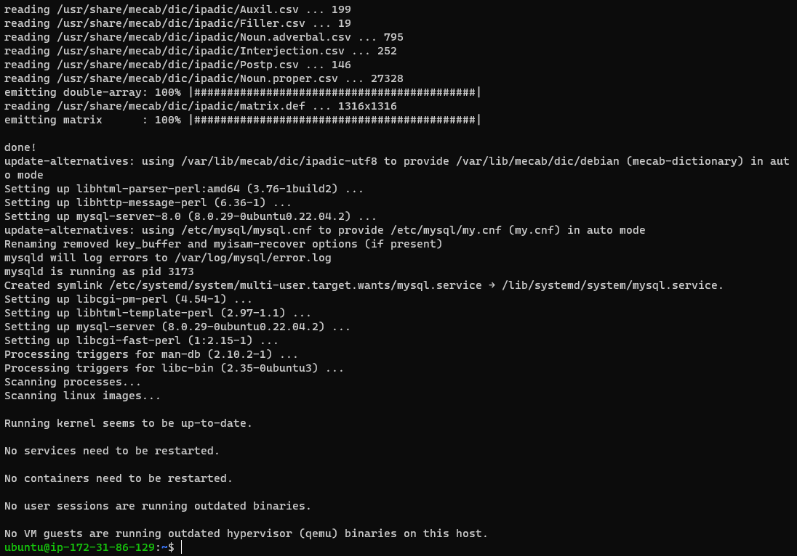

`Login to MYSQL Server`

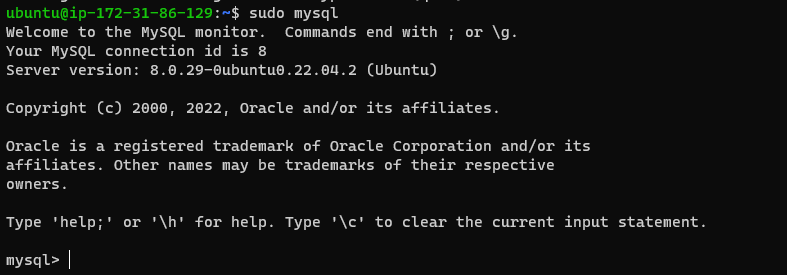

`Setting MYSQL Server Password`

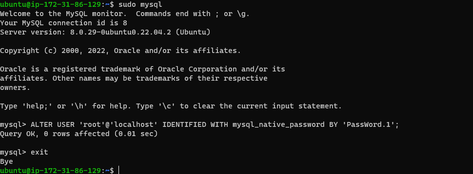

`Installing PHP`

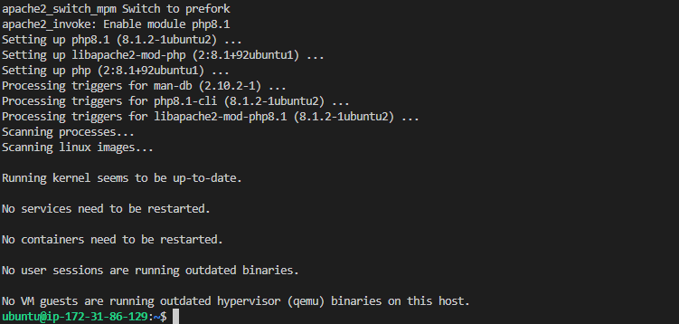

`Confirm PHP`

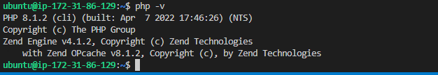

`Create Virtual Host for website using apache`

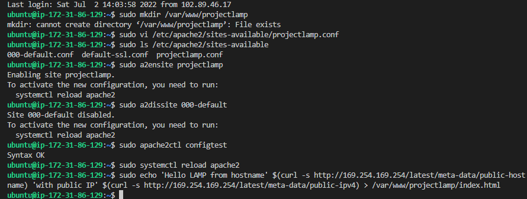

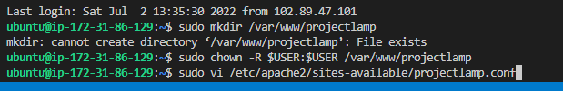

`Enable PHP on the site`

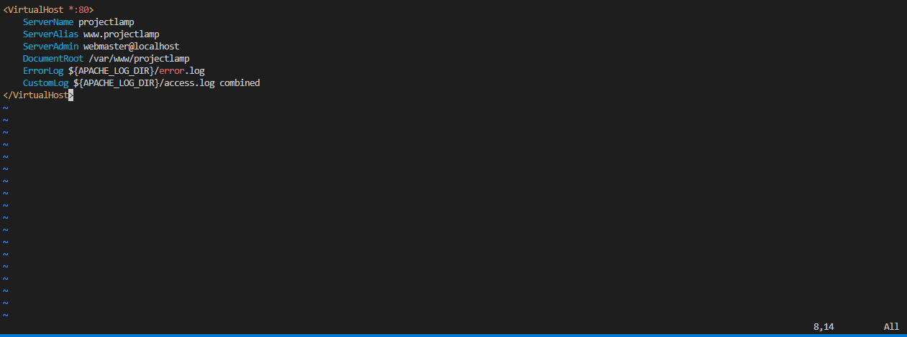

`Create index.html`

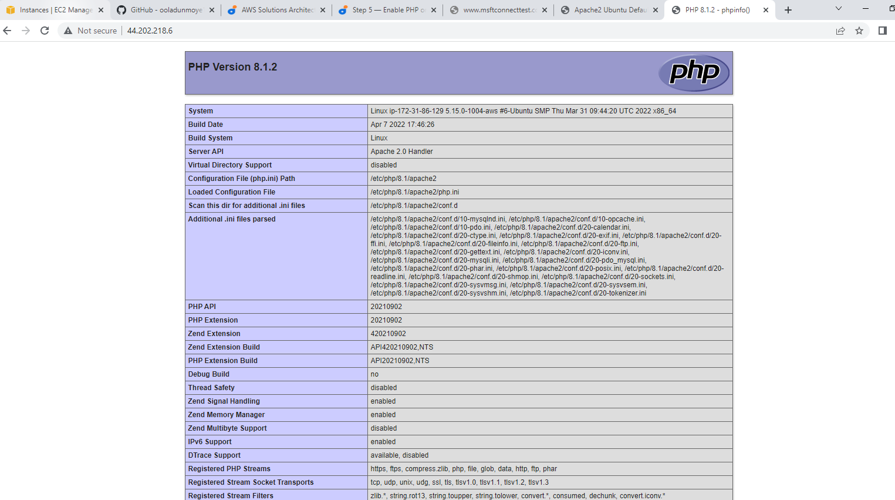

`Remove Created file`

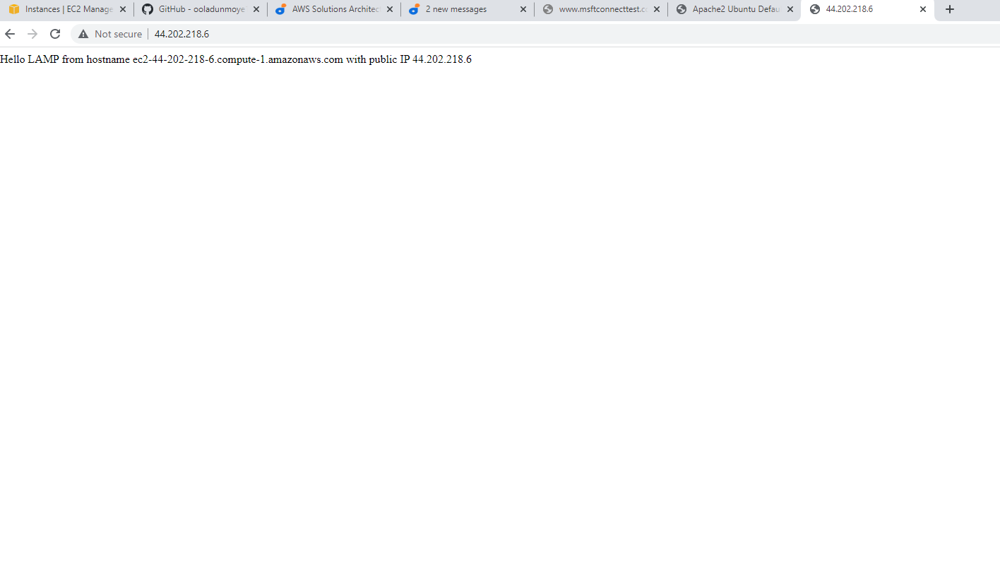

`THIS IS JUST THE LEARNING BEGINNING`

`THANK YOU`